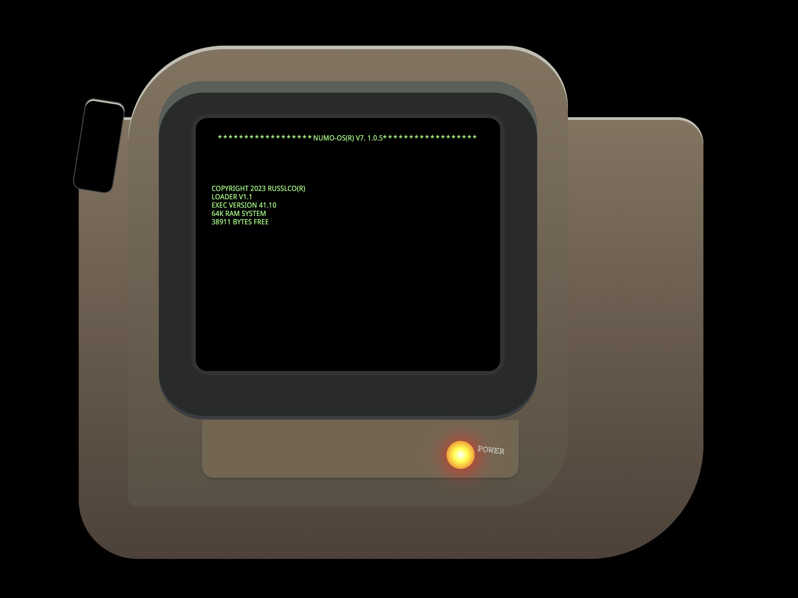

# Css to the rescue

## Overview
In this subject I am tasked to explore the possibilities of css by making a certain assignment.

### Assignments
1. Modulaire Control panel
2. Interactive firework show
3. 3D Rubriks cube :goat:
4. Tailwind without Tailwind

### Decision
I ended up choosing for the modulaire control panel because I saw the most potential in that one and I wanted to know how you can handle different kinds of interactions with css only.

### Criteria
* No use of Javascript only html and css
* No ids and classes
* Keep grinding big dawg

## Week 1 :thinking:
This week I was looking at what I was gonna create. I looked at different control panels that I thought were nice to make.

### Ideas & Concept
| Death star      |
| :---        |  
|   |

First idea that popped up in my head was to create the death star control panel from the Star wars franchise. I thought it would be a really cool concept to make but my css abilities limited me from actually making this so I ended up not going for it.

| Spaceship control panel      |
| :---        |  
|   |
My second idea was to make the inside of a space ship. I definitely thought that this is something what I could do but I had a hard time what I wanted to make for the interaction.

| Pip boy fallout      |
| :---        |  
|   |

My final idea and the idea I settled for was to create pip boy from the fallout series. This concept looked the most fun to me and also do-able. The next step was to figure how I would create this concept in css.

### Gameplan
| Pipboy lofi layout | Pipboy final
| :---: | :--:
| | |
After looking around on the internet I found images that showcased the pipboy control panel in a 2d format.

### Interaction
The interaction would be the startup animation of the pip boy. The power button in the final design would be the trigger for the animation. The youtube link below showcases how the animation would work. Skip to **2:35** to see it.
[Pip boy interaction](https://www.youtube.com/watch?v=EHE3S-j-KZA)

### Challenges :sob:
Creating the general shape of the control panel wont be much of a problem. Challenge might occur in how I will make the typing animation and how I would trigger it without Javascript

* Creating a typing animation
* Trigger the animation when the power button turns on
* Make the different details on the control panel (might take some time)

### Progress
|Pip boy progress|
|:---:|
||
This was  the progress I made the first week created the general shape of the control panel.

Starting from the back I used a div element and styled it with the code below
```
main > div{
    width: 710px;
    height: 500px;
    background: linear-gradient(#84735e,#4f4138);
    border-radius: 40px 30px 130px 67px;
    display: flex;
    justify-content: center;
    align-items: center;
}
```

Simple css nothing to crazy. I used the `border-radius` property to manipulate the different corners and for the color I used a simple `linear-gradient`.

### Reflection
In the first feedback round one of my fellow classmates gave me an idea on how I should style the power button and create the interaction. What did I learn this week you might ask? Not much below the feedback I got from a classmate :goat:

* Use before and after to create the power button 
* Try to minimize the use of pixels units
* Skip the general shape for now and focus more on the interaction

## Week 2
This week I made more progress on the control panel.
|Pip boy progress|
|:---:|
||

### Particular code
For the lil screw at the top left see code below
```
main > div > div:nth-of-type(1) {
    background-color: black;
    border: 1px solid #4e4d4d;
    width: 46px;
    height: 105px;
    border-radius: 10px;
    top: -23px;
    left: 0;
    position: absolute;
    transform: rotate(9deg);
    box-shadow: inset 0px 2px var(--shine-color);
}
```
Nothing crazy going on just some simple css. The cool part is how I styled the power button.

html for the power button:

```
<div aria-label="lower-part">
    <div aria-label="button">
        <input  type="checkbox" id="power-button">
        <label for="power-button"></label>
    </div>
</div>
```
 Styling for the power button:
 ```
input[type="checkbox"] {
    position: absolute;
    width: 1px;
    height: 1px;
    padding: 0;
    margin: -1px;
    overflow: hidden;
    white-space: nowrap;
    border: 0;
}

label {
    position: relative;
    height: 2em;
    width: 2em;
    background-color: black;
    border-radius: 50%;
    display: flex;
    transition: 0.4s;
}

label::after {
    content: "POWER";
    color: var(--shine-color);
    font-size: 0.8em;
    position: absolute;
    left: 35px;
    bottom: 16px;
    transform: rotate(7deg);
    font-family: monospace;
}
 ```

 So what happened you might ask :eyes:

 I styled the label of the checkbox instead of the actual checkbox self. The first step was to make the checkbox as small as possible and giving it a `position:absolute.

 Next I gave the label a `position:relative` and styled the power button how it should look in the final design.

 Lastly I used `::after` to create a psuedo element with `content: "POWER"`. I got this tip from a fellow classmate instead of using another element in the html.

 After this the power button obviously needs to work. This is the reason why the power button is a checkbox I used the :checked psuedo class selector to make it work.

 ### :checked :moon:
`:checked` is a pseudo-class selector in HTML that is used to select and style HTML elements that have been checked or selected by the user.

This pseudo-class is typically used with input elements, such as checkboxes and radio buttons, to apply styles to them when they are checked or selected. For example, you can use the :checked pseudo-class to change the background color or border color of a checkbox when it is checked.
This is how I used in my concept

```
input[type="checkbox"]:checked + label{
    background: radial-gradient(white,yellow,orange,red);
    box-shadow: 1px 1px 23px 2px red;
    transition: 0.4s;
}
```
`+` is used to target an element that immediately follows another element. It is called the "Adjacent Sibling Selector. So in my code I am saying target any label thats immediately followed after an input type checkbox which is `:checked`.

The end results was this. :flushed:
|Pip boy progress|
|:---:|
||

### Reflection
This week I didn't receive much feedback but I definitely learned alot more about css selectors. How with the `checked ` selector you can cause different interactions. I already knew how `:before:` and `after`worked in css but I always tried to avoid using those because I was a little bit unsure on how the actually worked. Lastly styling the label instead of the checkbox is a brilliant way to make your own custom checkboxes. In the upcoming weeks I will try to make the typing animation.

## Week 3
This week I focussed on making the typing animation(check video at the overview section).

Html:

```
<section>
    <p>NUMO-OS(R) V7. 1.0.5</p>
    <p>COPYRIGHT 2023 RUSSLCO(R)</p>
    <p>LOADER V1.1</p>
    <p>EXEC VERSION 41.10</p>
    <p>64K RAM SYSTEM</p>
    <p>38911 BYTES FREE</p>
    <!-- <P>NO HOLOTAPE FOUND</P>
    <P>LOAD ROM(1): DEITRIX 303</P> -->
</section>
```

I first created a section with different `<p>` elements simple am I right?
In the next example we are gonna take the first `<p>` element.
Next I am utilizing `:has` I never heard or used `:has` so what might it be?

### :has
`:has` is a CSS pseudo-class selector that allows you to select an element based on whether it contains a specific element or not. It selects elements that match a CSS selector and have at least one descendant matching another selector.

I used it like this in my code
```
main:has(input[type="checkbox"]:checked) div > div:nth-of-type(2) div:nth-of-type(1) div section p:nth-of-type(1) {
    animation: blink-caret .75s step-end infinite, typing 3.5s steps(40, end);
    animation-fill-mode: forwards;
}
```

In my example I am checking whether the main `:has` and input type checkbox which is checked if the checkbox is checked select the first `<p>` element in the section and apply some styling :open_mouth:.

### Animation
Animations in CSS (Cascading Style Sheets) allow you to create visually appealing effects and transitions on a webpage, such as fading in and out, sliding in and out, and bouncing. CSS animations use the @keyframes rule to define the animation's steps, which are then applied to an element using the animation property.

Example how I used animations in my code

```
@keyframes blink-caret {
    from, to { border-color: transparent }
    50% { border-color: var(--green); }
}
```

The first animation I made was the blink animation a simple animation that goes from transparent to the color green.
The keyframes rule defines the `blink-caret` animation which changes the `border-color` from transparent to green.

```
animation: blink-caret .75s step-end infinite, typing 3.5s steps(40, end);
```

I used the `animation` shorthand property to write the code in 1 clean one liner

* blink-caret is the `animation-name`
* .75s is the `animation-duration`
* step-end is the `animation-timing-function`
* infinite is the `animation-iteration-count`

I ended up applyng 2 animations to the `<p>` first being the blink-caret and the second being the actual typing animation.

The typing animation was hard to figure out but was quite simple once solved

```
@keyframes typing {
    0%{
        width: 0;
    }
    99.9%{
        border-right: 0.6em solid var(--green);
    }
    100%{
        border: none;
        width: 100%;
    }
  }
```

In the typing animation I am manipulating the `width` property for a `<p>` going from 0 to the given width once the width has reached a certain point the border will be removed and then the next typing animation will happen.

### Reflection

I originally didn't quite understand how animations work especially the sub properties but I survived. The hardest part was the step property to make the typing actually work originally the typing went in one smooth transition and thats not how typing should be my teacher ended up helping me out

* Not much feedback from my classmates

|Pip boy progress|
|:---:|
||

Obviously you cant see the typing animation but you can check it by clicking on the link in the description.

## Week 4
If the time is there this week I want to focus on making the details of the control panel will be continued...
|Pip boy progress|
|:---:|
||

### Sidenote
I ended up making an additional screen with the bounce animation its not working accordingly but I guess it was worth a try..
